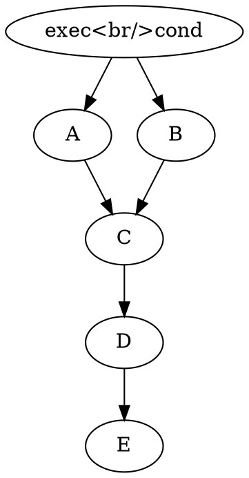
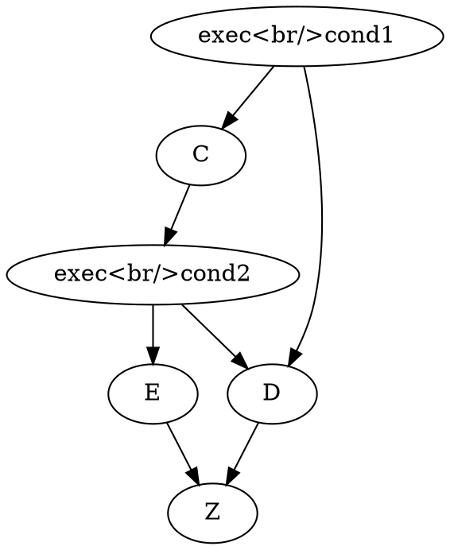
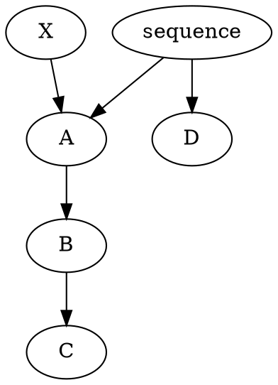
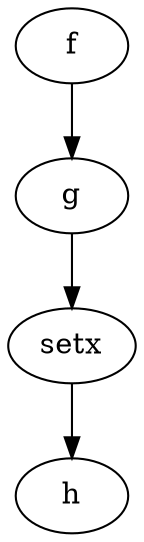

# Design

## Achieving Parity

### Positioning

An important part of parity is sanely positioning nodes as people would want to, the same way a code formatter makes people
forget about syntactical positioning.

#### Flow

Graph flow is horizontal right-going in blender.

#### Trees formatting

All nodes will be laid out horizontally with identical (adjustable via pragma?) vertical and horizontal distances,
with minimal intersecting links.
All groups will be laid out in the same fashion as nodes using external links.
A separate file can be generated for people wanting to preserve original node positions.

#### Orphan nodes as comments

<!-- I suppose I need screenshots... -->

Often times people will leave orphan nodes as alternative paths through the graph as a form of
comment that they had tried or will try that instead.

They are often vertically aligned since the flow of the graph is horizontal.

Detecting this is difficult, probably as a start, will use a weighted vertical symmetry check
and place the orphan code as a comment above.

The above solution is somewhat unaligned with achieving parity but more aligned with semantic intent.

### Meanings and conventions in nodes

- orphan nodes are vertically aligned comments
- reroute nodes imply intermediate variables... this isn't always true
- reused outputs imply an intermediate variable
- groups are used as variable names

```graphlang

;; need to look at a typed lisp, assume for now i32 allows you to define bindings that only accept an i32
(define (max (i32 a) (i32 b))
  (if (> a b) a b))

;; type arguments?
(define (max (type n) (n a) (n b))
  (if (> a b) a b))

(define (subgraph (vec4 color) (vec4 color))
  (group "name"
    (define x 5)
    (define y (+ 10 x)))
  (group)
  )
```

### Intended competition

- Unreal Engine Blueprint compatibility
- Blender geometry nodes compatibility
- other visual scripting systems?

### Ideas

- LLVM
- C ffi

### node-group conversions:

#### branch then join



```lisp

(if cond
  A
  B)
C
D
E
```

So we must analyze the branches of an if for convergence. Consider the following:



```
B1 -> C -> B2 -> E -\
  \----------\-> D --> Z
```

Naive conversion:

```lisp
(if B1
  (begin
    C
    (if B2
      E
      D))
  D)
Z
```

Z and D both converge B1.
A pin joins a branch node B if it takes 2 input links which can _direct input reach_ B.
Where _direct input reach_ means there exists a non-branching path following links to input nodes
(backwards), between the branch and the node.

In this case:
- B2 is joined by Z, meaning that the branch finishes before it there
- since Z joins both B1 and B2, it can be pulled out of both
- B1 is joined by Z
- B1 is not joined by D because one of the input links go through another branch
- because of this, the two references to D becomes a definition

All macro's (which are the only nodes that can contain multiple pins) must be evaluated through their
expansions.

A subbranch that joins can be reduced as a direct input for a superbranch

##### Graph joins

Attempts to create a cycle will be met with a label
```graphlang
(define (till5 (i32 x))
  ;; labels attach to right before the first expression of a line
  ;; if there is no expression on the line, it attaches to the next expression
  (if (< x 5)) #:a
    (begin
      (++ x)
      (goto a))
    (print x))
```

is isomorphic to:

```dot
digraph till5 {
  get_x_1 -> (< _ 5)
  (< x 5) -> (++ x)
  get_x_2 -> (++ x)
  (++ x) -> (goto a)
  (< x 5) -> (print x)
  get_x_3 -> (print x)
}
```

#### segment sequence

This is hard because `a->b->c` is different in the visual realm from `sequence(->a ->b ->c)`,
but in the text realm those are mostly the same



idea 1:

```lisp
;; segment is duplicated... not idiomatic in text realm...
(begin (x)
       (a)
       (b)
       (c))
(begin (begin (a) (b) (c))
       (begin (d)))
```

idea 2:

```lisp
(define A (a) (b) (c))
(begin (x)
       (A))
;; double begin (sequence) is not idiomatic
(begin (begin (A))
       (begin (d)))
```

##### how about backwards?

Maybe it's OK if we consider that integrating this technology into existing blueprints
will change them slightly... doubly-entered segments can be extracted to a function or macro
for better composability if they do not have clean rejoins
<!-- TODO: better define which kinds of double-entered segments can't be rejoined...
     maybe an early return will suffice in most cases so that remaining paths
     can join. -->

```lisp
(begin
  (f)
  (g)
  ;!
  (set! x 10)
  (h x))
```

idea 1:


Maybe instead of supporting sequences we can do vertical reroutes?
